# GUST: Combinatorial Generalization by Unsupervised Grouping with Neuronal Coherence

## 1. Introduction

Dynamically grouping sensory information into structured entities is essential for understanding the world of combinatorial nature. However, the grouping ability and therefore combinatorial generalization are still challenging artificial neural networks. Inspired by the evidence that successful grouping is indicated by neuronal coherence in the human brain, we introduce GUST (Grouping Unsupervisely by Spike Timing network), an iterative network architecture with biological constraints to bias the network towards a dynamical state of neuronal coherence that softly reflects the grouping information in the temporal structure of its spiking activity. We evaluate and analyze the model on synthetic datasets. Interestingly, the segregation ability is directly learned from superimposed stimuli with a succinct unsupervised objective. Two learning stages are present, from coarsely perceiving global features to additionally capturing local features. Further, the learned symbol-like building blocks can be systematically composed to represent novel scenes in a bio-plausible manner.

An example video of binding process is as follows (Each figure in the animation shows the binding process of a specific input image):
https://user-images.githubusercontent.com/50747459/202335770-a05ac897-4200-45a2-b424-2c0203c512fd.mp4
<video src=".//images//spike_all.mp4"></video>

## 2. Code

### 2.1 Environment

The following packages should be installed before running this project:

```
pytorch
matplotlib
seaborn
h5py
numpy
sklearn
notebook
```

### 2.2 Code interpretation

#### 2.2.1 Train network

The script used to train network is `run.sh`. Make directories, train a network, and save it:

```
./run.sh
```

After trained a network, it will be stored in the directory of `./tmp_net`. The network in the file `./example_net` is an example of trained network.

Clean the temporary files:

```bash
./clean.sh
```

#### 2.2.2 Analyze results

Calculate the AMI and SynScore of a trained network:

```bash
python draw_ami_syn_score.py
```

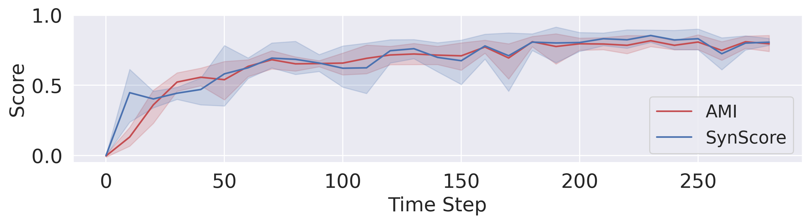

Draw the dyeing results like the first line of Fig. 4:

```bash
python draw_color.py
```

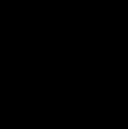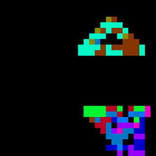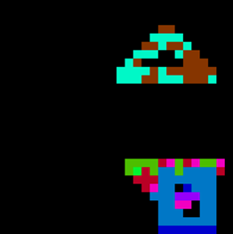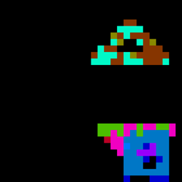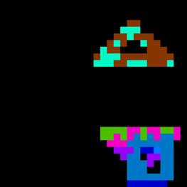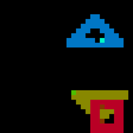

Save results to a file:

```
python save_results.py
```

`save_results.py` stores the results as a numpy object and the notebook `draw_figure.ipynb` can use the result to plot the following figures:

1. the input and output images
2. the spiking results
3. the binding results
4. the figure of AMI and SynScore

The spiking results:

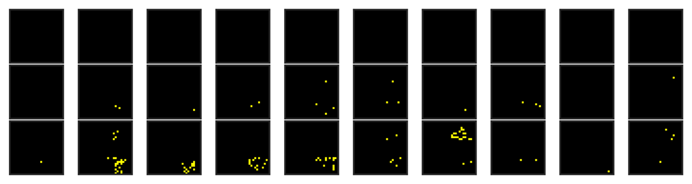

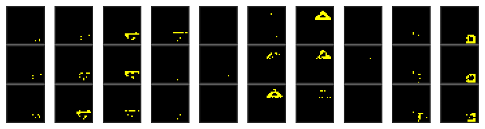

The binding results:

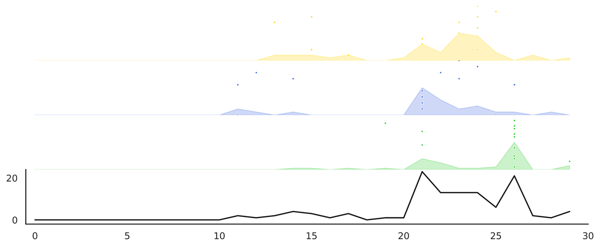

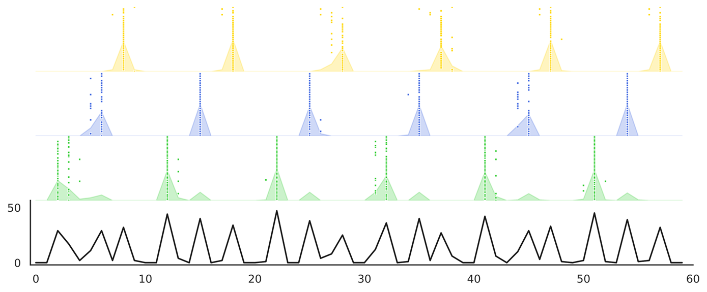
